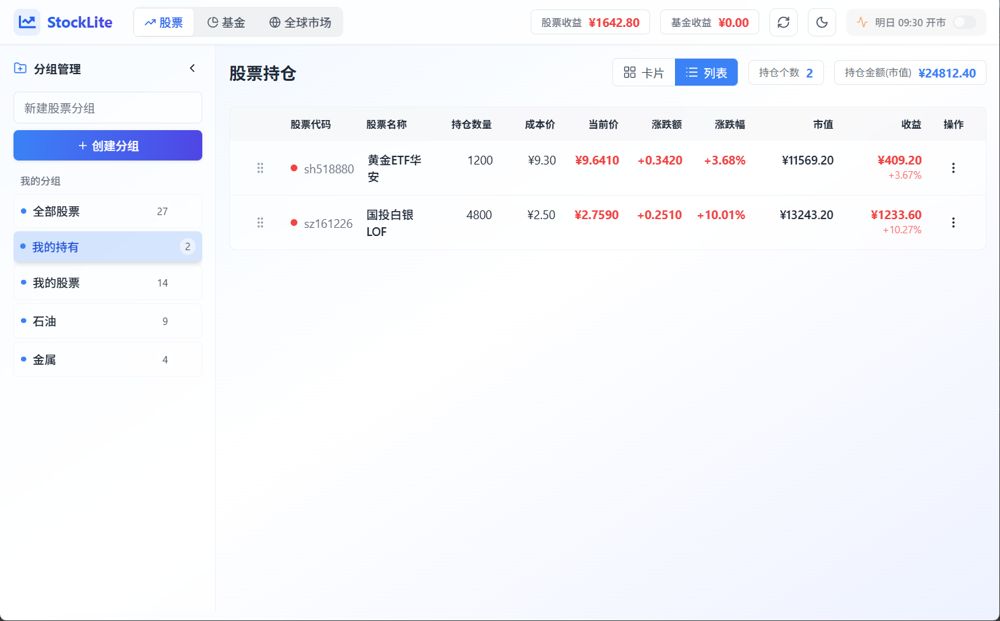
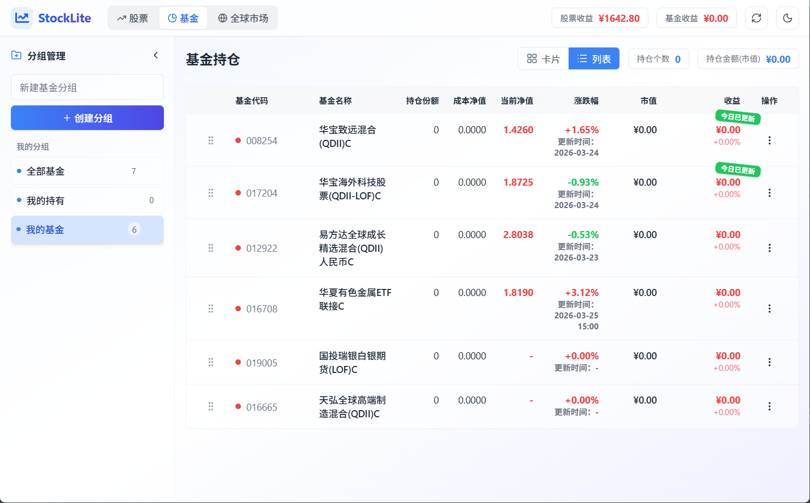

# StockLite - 股票基金全球市场持仓管理工具

一个基于 **Electron + React + TypeScript** 的现代化桌面应用，专注于股票、基金和全球市场指数的持仓收益管理。支持分组管理、实时行情、深色模式、拖拽排序、表头排序，提供流畅的用户体验。

## ⚡ 快速开始

### 安装依赖
```bash
npm install
```

### 开发模式（推荐）
```bash
npm run dev
```
启动 Vite 开发服务器和 TypeScript 编译器，支持热更新。

### 生产模式启动
```bash
npm run build
npm run start
```

### 开发模式启动（带 DevTools）
```bash
npm run start:dev
```

### 打包安装程序（Windows）
```bash
npm run package
```
生成 Windows NSIS 安装器到 `release/` 目录。

## 🎯 核心特性

- **分组** - 股票、基金 支持分组管理, 并有全部分组和我的持有两个固定分组
- **股票** - 支持大部分股票延迟5s的行情查看, 并支持设置持仓数量和成本, 自动统计市值和收益
- **基金** - 与股票功能类似, 基金净值更新时会有额外tag标识, 部分基金可能无数据, 取决于接口
- **全球市场** - 显示主要股市的行情, A股数据支持实时刷新, 日经和港股缺乏接口支持, 暂不支持实时显示

## 🚀 技术栈

| 类别          | 技术                | 版本      |
|-------------|-------------------|---------|
| **应用框架**    | Electron          | 40.6.1  |
| **前端库**     | React             | 19.2.4  |
| **类型系统**    | TypeScript        | 5.9.3   |
| **构建工具**    | Vite              | 7.3.1   |
| **状态管理**    | Zustand           | 5.0.11  |
| **数据库**     | better-sqlite3    | 12.6.2  |
| **样式框架**    | Tailwind CSS      | 3.4.19  |
| **图标库**     | Lucide React      | 0.576.0 |
| **HTTP客户端** | Axios             | 1.13.6  |
| **拖拽排序**    | @dnd-kit/core     | 6.3.1   |
| **拖拽排序**    | @dnd-kit/sortable | 9.1.0   |


## 更新日志

### 1.6.0

2026-3-25 更新内容如下

- 修复分组展开失败的问题
- 修复持仓数量显示
- 关闭程序行为优化
- 新增持有市值
- 修复股票移动分组功能
- 新增我的持仓固定分组
- 新增基金更新标识
- 修复部分基金净值更新问题


## 页面截图

### 股票



### 基金

